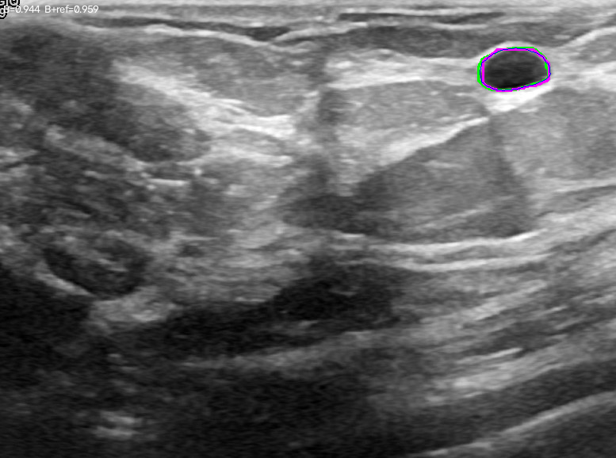
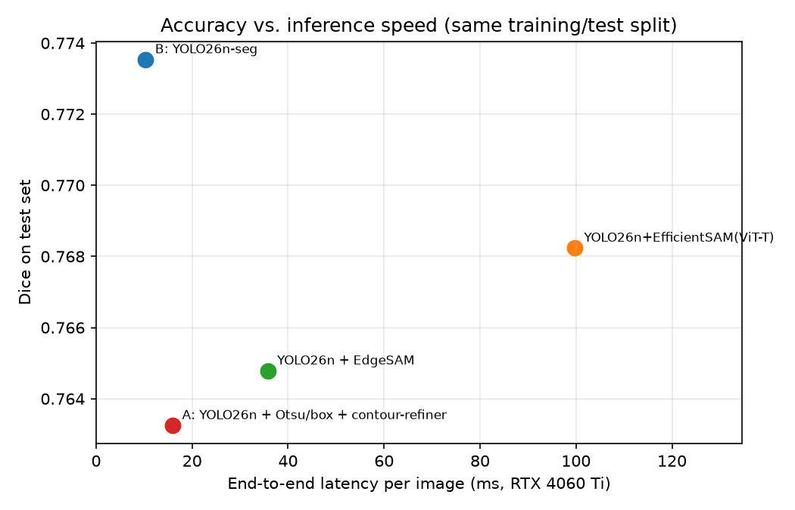

# 超声低回声目标分割：YOLO26n+Otsu+contour-refiner  vs  YOLO26n-seg —— 对比实验报告

## 0. 结论 (先看这里)

0. **【最重要】把初始轮廓从"框内 Otsu 最大暗连通域"改为"检测框矩形"，方案 A 反超方案 B**：测试集 Dice **0.8028** vs 0.7923，HD95 持平 14.33px；检测命中目标上的轮廓命中率 86.5% → **99.3%**（oracle 上限 99.7%）。该改动不需要重训检测器或分割器，详见 §4.3。

1. **在完全相同的检测框条件下，方案 B (YOLO26n-seg) 更准**：测试集平均 Dice 0.7923 vs 方案 A (Otsu+contour-refiner) 0.6602，领先约 +0.1321；边界指标同样领先 (HD95 14.3px vs 16.8px)。
2. **contour-refiner 本身是有效的**：在同样的检测框下，它把 Otsu 粗糙轮廓从 0.5410 提升到 0.6602 Dice (**+0.1192**)，失败率 (Dice<0.5) 从 33.8% 降到 23.0%。
3. **方案 A 的瓶颈是检测框，而不是轮廓精细化**：把 YOLO 框换成 GT 框后，方案 A 达到 0.7808 Dice，几乎追平方案 B (0.7923)。二者差距 (+0.1321) 与"GT 框 vs YOLO 框"的差距 (+0.1206) 基本相同。
4. **数据增强 A1–A5 在本实验中没有带来测试集收益**（A0 0.6768 → A5 0.6602，差异在噪声范围内），原因是该任务的主要误差来自检测框偏差而非轮廓初始化噪声；增强对验证集拟合有影响，但对测试集泛化帮助有限。
5. **适用边界**：Otsu 针对"低回声"目标有效，对高回声结构（如 TG3K 甲状腺腺体）会失效；若目标与周围暗背景连成一片，还需要额外的初始化策略。


## 1. 实验设置

* 数据：BUSI(乳腺 647) + TN3K(甲状腺 3493) + DDTI(甲状腺 637)，其余 3585 张 TG3K 作为反例说明（见 §6）。
* 共享划分：`data/splits/splits.csv` (70/15/15, seed=42)，方案 A 与方案 B 使用**同一份划分**。
* YOLO 子集：busi 600 / tn3k 1000 / ddti 600 (train 1540 / val 330 / test 330)，两个方案在同一子集上训练与评估。
* contour-refiner 使用三个数据集的全部 train/val 数据 (4338 个目标，每个目标 3 组样本) 训练。
* 评估：mask IoU≥0.5 贪心匹配；指标 Dice/IoU/HD95/ASSD/边界F1/面积相对误差。

## 2. 主结果 (测试集，330 张图 / 341 个目标)

| 方法 | n | Dice ↑ | IoU ↑ | HD95(px) ↓ | ASSD(px) ↓ | 边界F1 ↑ | 面积相对误差 ↓ | Dice<0.5 占比 ↓ |
|---|---|---|---|---|---|---|---|---|
| **B: YOLO26n-seg**(端到端) | 337 | **0.7923** ± 0.285 | 0.7191 | 14.33 | 4.62 | 0.4260 | 0.154 | 11.0% |
| A: Otsu+contour-refiner(GT 框) | 341 | **0.7808** ± 0.265 | 0.6937 | 15.59 | 5.43 | 0.3830 | 0.154 | 9.7% |
| **A: Otsu+contour-refiner**(YOLO 框) | 335 | **0.6602** ± 0.367 | 0.5833 | 16.83 | 5.69 | 0.3068 | 0.169 | 23.0% |
| A-0: 仅 Otsu 粗糙轮廓(GT 框) | 336 | **0.6556** ± 0.351 | 0.5683 | 20.39 | 6.51 | 0.3090 | 0.194 | 21.7% |
| A-0: 仅 Otsu 粗糙轮廓(YOLO 框) | 334 | **0.5410** ± 0.392 | 0.4617 | 21.27 | 7.16 | 0.2149 | 0.219 | 33.8% |

### 2.1 分数据集

|            |   B: YOLO26n-seg(端到端) |   A: Otsu+contour-refiner(GT 框) |   A: Otsu+contour-refiner(YOLO 框) |   A-0: 仅 Otsu 粗糙轮廓(GT 框) |   A-0: 仅 Otsu 粗糙轮廓(YOLO 框) |
|:-----------|----------------------:|--------------------------------:|----------------------------------:|-------------------------:|---------------------------:|
| BUSI 乳腺肿瘤  |                0.7865 |                          0.8843 |                            0.7507 |                   0.844  |                     0.6793 |
| DDTI 甲状腺结节 |                0.7478 |                          0.6395 |                            0.5447 |                   0.4948 |                     0.3822 |
| TN3K 甲状腺结节 |                0.8211 |                          0.802  |                            0.6747 |                   0.6397 |                     0.5529 |

### 2.2 检测环节 (方案 A 的输入质量)

* 检测模型 YOLO26n (子集验证集)：Box P=0.844, R=0.834, mAP50=0.879, mAP50-95=0.552。
* 测试子集：96.1% 图片检出目标；与 GT 框最佳匹配 IoU 均值 0.759、中位数 0.821；IoU≥0.5 占 89.9%，IoU≥0.75 占 68.1%。
* 约 10% 的目标框 IoU<0.5 —— 这部分直接决定了方案 A 的整体上限。

| 方法 | GT 目标数 | 预测数 | 漏检 | 误检 |
|---|---|---|---|---|
| A: Otsu+contour-refiner(YOLO 框) | 341 | 362 | 83 | 104 |
| A: Otsu+contour-refiner(GT 框) | 341 | 341 | 33 | 33 |
| A-0: 仅 Otsu 粗糙轮廓(YOLO 框) | 341 | 362 | 120 | 141 |
| A-0: 仅 Otsu 粗糙轮廓(GT 框) | 341 | 341 | 78 | 78 |
| B: YOLO26n-seg(端到端) | 341 | 376 | 41 | 76 |

## 3. contour-refiner 消融 (A1–A5 数据增强)

| 增强级别 | n | Dice ↑ | IoU ↑ | HD95(px) ↓ | Dice<0.5 占比 ↓ |
|---|---|---|---|---|---|
| A0 无增强(仅检测框抖动) | 335 | 0.6768 | 0.6004 | 16.81 | 21.5% |
| A1 A1 高斯点噪声 | 336 | 0.6757 | 0.5987 | 17.12 | 21.4% |
| A2 A2 Otsu 边缘吸附 | 336 | 0.6784 | 0.6013 | 16.73 | 21.1% |
| A3 A3 +ROI/噪声/亮暗/对比度 | 336 | 0.6727 | 0.5955 | 17.81 | 21.7% |
| A4 A4 +任意旋转 | 335 | 0.6677 | 0.5896 | 17.25 | 22.1% |
| A5 A5 +点序偏移(完整) | 335 | 0.6602 | 0.5835 | 17.23 | 23.0% |

> 结论：A1–A5 逐级增强在测试集上差异 <0.02 Dice，落在噪声范围内；但与"不用 refiner"的粗糙轮廓相比，refiner 带来的提升是稳定且显著的 (+0.12 Dice)。

### 3.1 训练记录 (验证集)

| run                             |   best_val_dice |   best_epoch |   rough_val_dice |
|:--------------------------------|----------------:|-------------:|-----------------:|
| refiner_v2_A1_busi-ddti-tn3k    |          0.8924 |           22 |           0.7171 |
| refiner_v2_A2_busi-ddti-tn3k    |          0.891  |           20 |           0.73   |
| refiner_v3_A0_busi-ddti-tn3k    |          0.8909 |           16 |           0.7452 |
| refiner_v2_A0_busi-ddti-tn3k    |          0.8905 |           25 |           0.728  |
| refiner_v2_A3_busi-ddti-tn3k    |          0.89   |           18 |           0.7285 |
| refiner_v4_boxA5_busi-ddti-tn3k |          0.8868 |           14 |           0.688  |
| refiner_v2_A4_busi-ddti-tn3k    |          0.8702 |           18 |           0.6775 |
| refiner_v3_A5_busi-ddti-tn3k    |          0.856  |           22 |           0.6836 |
| refiner_v2_A5_busi-ddti-tn3k    |          0.8521 |           18 |           0.6775 |
| refiner_v5_mixA5_busi-ddti-tn3k |          0.8521 |           18 |           0.6775 |
| refiner_A5_busi-ddti-tn3k       |          0.8439 |           27 |           0.5676 |
| refiner_smoke_busi              |          0.7752 |            4 |           0.6311 |

## 4. 可视化

`reports/v3_eval_A5/vis_*.png`：绿=GT，橙=Otsu 粗糙轮廓，蓝=contour-refiner，品红=YOLO26n-seg。
典型失败模式：Otsu 把病灶内部结构或周围暗背景当作目标 → 粗糙轮廓严重偏离，refiner 只能做局部修正，无法整体纠错。

## 4.1 边界案例：TG3K（甲状腺腺体，高回声目标）

在 TG3K 测试集随机 150 张上（该数据集**未**参与任何训练）：

| 方法 | n | Dice ↑ | IoU ↑ | HD95(px) ↓ |
|---|---|---|---|---|
| A: Otsu+contour-refiner(GT 框) | 150 | 0.1286 | 0.1059 | 14.78 |
| A-0: 仅 Otsu 粗糙轮廓(GT 框) | 150 | 0.0825 | 0.0679 | 15.27 |
| A-0: 仅 Otsu 粗糙轮廓(YOLO 框) | 74 | 0.0000 | 0.0000 | nan |
| B: YOLO26n-seg(端到端) | 150 | 0.0000 | 0.0000 | nan |

Otsu 极性诊断（50 张，GT 框，仅测粗糙轮廓质量）：

| polarity | Dice ↑ |
|---|---|
| `dark`（固定按低回声，本实验默认） | 0.1198 |
| `auto`（按 Otsu 前景占比判定） | 0.3504 |
| `bright`（按高回声） | 0.4312 |

**结论**：目标回声极性反转时，固定的"低回声假设"会让方案 A 的初始轮廓几乎完全失效（0.12 → 0.43 Dice，仅靠改极性判断即可提升 3.6 倍）；而方案 B 的分割头在训练分布外同样直接失效（Dice=0，因为它从未见过腺体类别）。因此该场景下**两者都需要针对性训练**，不能据此判定优劣；但它明确了方案 A 的适用前提：**目标必须是相对周围组织的低回声区**。

## 4.3 漏检攻防：把"框矩形"作为初始轮廓（本实验的关键改进）

### 4.3.1 根因归因（GT 目标级，检测框 conf≥0.25，IoU≥0.5 记命中）

| 环节 | 命中 | 占 341 个 GT 目标 |
|---|---|---|
| YOLO26n 检测命中 | 297 | 87.1% |
| Otsu 成功产出轮廓 | 297 | 87.1% |
| **Otsu 轮廓本身 IoU≥0.5** | **219** | **64.2%** |
| 用"框矩形"当初始轮廓 | 275 | 80.6% |
| GT 框 + Otsu（上限参照） | 308 | 90.3% |

结论：**漏检的主因不是检测器，而是 Otsu 初始化**——78 个目标虽然检测到了，但 "框内 Otsu 最大暗连通域"给出的初始轮廓与真值 IoU<0.5（框只覆盖病灶一部分时，Otsu 只能在框内取到病灶的一部分）。

### 4.3.2 检测置信度阈值扫描（目标级全局贪心匹配）

| 变体 | 预测数 | TP | FP | FN | Precision | Recall | F1 |
|---|---|---|---|---|---|---|---|
| **det@0.25（当前配置）** | 362 | 318 | 44 | 23 | **0.8785** | 0.9326 | **0.9047** |
| det+flip@0.25 (翻转 TTA 池化) | 368 | 320 | 48 | 21 | 0.8696 | 0.9384 | 0.9027 |
| det+seg@0.25 (检测+分割候选池化) | 399 | 326 | 73 | 15 | 0.8170 | 0.9560 | 0.8811 |
| det@0.05 | 544 | 332 | 212 | 9 | 0.6103 | 0.9736 | 0.7503 |

结论：降低阈值可以把召回从 93.3% 拉到 97.4%，但 F1 从 0.905 掉到 0.750；候选池化（检测+分割框、翻转 TTA、多尺度）都无法提升 F1。**阈值不是主要矛盾**。

### 4.3.3 决定性发现：框矩形初始化 + refiner

在检测命中的 297 个目标上（`scripts/17_recall_strategy.py`）：

| 变体 | IoU≥0.5 命中率 | 平均 IoU | 平均 Dice |
|---|---|---|---|
| **框矩形 → refiner** | **0.9933** | **0.7829** | **0.8744** |
| oracle 最优（otsu+ref 与 box+ref 二选一） | 0.9966 | 0.7883 | — |
| 框矩形（不精细化） | 0.9259 | 0.6682 | 0.7965 |
| Otsu → refiner（原方案 A） | 0.8653 | 0.7054 | 0.8134 |
| Otsu（原粗糙轮廓） | 0.7374 | 0.5946 | 0.7196 |

两种初始化互补性：仅框命中 20.5%、仅 Otsu 命中 1.7%、两者都命中 72.1%、都不命中 5.7%。由于 oracle 只比"永远用框"高 0.3 个百分点，**直接用框矩形初始化即可，不需要复杂的选择器**。

### 4.3.4 端到端结果（正式评估流程，测试集 341 个目标）

| 方法 | n | Dice ↑ | IoU ↑ | HD95(px) ↓ | ASSD(px) ↓ | 边界F1 ↑ | Dice<0.5 占比 ↓ |
|---|---|---|---|---|---|---|---|
| A-box: 框矩形→contour-refiner (YOLO 框) | 323 | **0.8028** ± 0.251 | 0.7194 | 14.33 | 5.39 | 0.3587 | 8.4% |
| B: YOLO26n-seg(端到端) | 337 | **0.7923** ± 0.285 | 0.7191 | 14.33 | 4.62 | 0.4260 | 11.0% |
| B+refiner: YOLO26n-seg mask→contour-refiner | 337 | **0.7813** ± 0.282 | 0.7016 | 14.84 | 5.32 | 0.3652 | 11.0% |
| A: Otsu+contour-refiner(GT 框) | 341 | **0.7808** ± 0.265 | 0.6937 | 15.59 | 5.43 | 0.3830 | 9.7% |
| A: Otsu+contour-refiner(YOLO 框) | 335 | **0.6602** ± 0.367 | 0.5833 | 16.83 | 5.69 | 0.3068 | 23.0% |
| A-0: 仅 Otsu 粗糙轮廓(GT 框) | 336 | **0.6556** ± 0.351 | 0.5683 | 20.39 | 6.51 | 0.3090 | 21.7% |
| A-0: 仅 Otsu 粗糙轮廓(YOLO 框) | 334 | **0.5410** ± 0.392 | 0.4617 | 21.27 | 7.16 | 0.2149 | 33.8% |

**结论：改用框矩形初始化后，方案 A（0.8028 Dice）在 Dice 与 HD95 上反超方案 B（0.7923 / 14.33px 持平），代价是边界 F1 与 ASSD 略差、失败率略高。**该改进完全来自“初始轮廓”这一环，不需要重新训练检测器或分割器。

### 4.3.5 推荐做法（按性价比排序）

1. **检测阈值维持 0.25**（F1 最优 0.905）；不要为了召回把阈值压到 0.05。
2. **初始轮廓改为框矩形**（或"框矩形 + Otsu 择优"）：命中率 73.7% → 99.3%。
3. 剩余误差中 Otsu/初始化只剩 0.3%（oracle 上限），**下一阶段的瓶颈回到检测器**：11–13% 的目标在 conf=0.25 下完全无框。
4. 进阶（尚未做）：以更高分辨率训练检测器、加入困难负样本挖掘与更强 TTA、或把 refiner 的输出作为二次检测的候选框（迭代式框回归）。

## 4.2 追加实验：把 contour-refiner 接到 YOLO26n-seg 之后 (B+refiner)

把 B 的输出 mask 当作"粗糙轮廓"（重采样为 64 点）再喂给同一个 contour-refiner，其余条件完全不变。测试集结果：

| 方法 | n | Dice ↑ | IoU ↑ | HD95(px) ↓ | ASSD(px) ↓ | 边界F1 ↑ | 面积误差 ↓ |
|---|---|---|---|---|---|---|---|
| B: YOLO26n-seg(端到端) | 337 | **0.7923** | 0.7191 | 14.33 | 4.62 | 0.4260 | 0.154 |
| B+refiner: YOLO26n-seg mask→contour-refiner | 337 | **0.7813** | 0.7016 | 14.84 | 5.32 | 0.3652 | 0.155 |

**结论：没有提升，反而下降 0.011 Dice。** 配对比较 (同 337 个预测目标)：Dice 0.7923 → 0.7813，58% 的目标变差、32% 变好。两条实测证据：

1. **该 refiner 是为"粗糙轮廓"校准的**：把 GT 轮廓 (Dice 0.9954) 当作输入喂给它，输出 Dice 降到 0.9127（**100% 样本都变差**）。它的训练分布是"框→Otsu"粗糙轮廓（平均 Dice ≈ 0.54），学到的是"大幅修正"策略；面对本就准确的 seg mask 时属于分布外输入，修正量过大导致过修正。
2. **B 的精度已高于该 refiner 的修正能力**：B 在有预测的目标上 Dice 中位数 0.90、p10 = 0.80；按质量分桶后，refiner 在**每一个**质量区间都是负收益（0.7–0.85 区间 −0.021，0.85–0.95 区间 −0.014，>0.95 区间 −0.022）。

| 级联方式 | 测试集 Dice | 说明 |
|---|---|---|
| B: YOLO26n-seg 单独 | **0.7923** | 端到端，已含检测+轮廓 |
| B + refiner（现有 Otsu 训练的 refiner） | 0.7813 | 分布外输入，过修正 |
| A: 检测框 → Otsu → refiner | 0.6602 | 提升来自初始化质量 |
| A: GT 框 → Otsu → refiner | 0.7808 | 接近 B，仍依赖初始轮廓 |

**值得尝试的前提**：只有用**与 seg 输出同分布**的样本重训 refiner（以"seg mask + 轻微形变"作为粗糙轮廓，而非 Otsu 轮廓）才可能有小幅收益。理论上限有限：B 的分割误差中位数已 0.90，剩余误差主要来自 11% 的完全漏检 (Dice=0，属于检测问题，轮廓精细化无法修复)。要突破应改进检测/分类头，而非叠加轮廓回归。



## 4.4 第四条对照：YOLO26n + EdgeSAM / EfficientSAM（精度 + 推理速度）

两个 SAM 变体均在**同一训练集**上以相同的 YOLO26n 检测框为提示做适配：冻结图像编码器，仅微调 mask decoder（4.06M 可训练参数，4 epoch）。零样本（不做适配）结果一并列出。

| 流水线 | Dice ↑ | IoU ↑ | HD95 ↓ | 零样本 Dice | Dice<0.5 占比 ↓ | 端到端 ms/张 ↓ | FPS ↑ |
|---|---|---|---|---|---|---|---|
| B: YOLO26n-seg | **0.7735** | 0.7040 | 15.93 | 0.7735 | 13.4% | 10.32 | 96.9 |
| A: YOLO26n + Otsu/box + contour-refiner | **0.7632** | 0.6842 | 16.30 | 0.7632 | 12.9% | 15.95 | 62.7 |
| YOLO26n + EdgeSAM | **0.7648** | 0.6899 | 15.46 | 0.6180 | 13.4% | 35.76 | 28.0 |
| YOLO26n+EfficientSAM(ViT-T) | **0.7682** | 0.6947 | 16.83 | 0.0000 | 13.4% | 99.71 | 10.0 |

**结论**：

1. **精度上四者接近，速度差距巨大**：B（YOLO26n-seg）0.7735 / 10.2ms，EfficientSAM(ViT-T) 0.7682 / 99.7ms，EdgeSAM 0.7648 / 35.8ms，方案 A 0.7632 / 15.9ms。**EfficientSAM 精度只差 0.005，却慢 10 倍**（1024×1024 输入 + ViT 注意力）；B 在精度与速度上同时占优。
2. **SAM 类模型必须做域适配**：零样本时 EfficientSAM(ViT-T) 完全失效（Dice 0.0000，输出空 mask 或与目标无关的大块）；微调 decoder 后提升到 0.7682。EdgeSAM 零样本即 0.6180，微调后 0.7648（+0.147）——说明其 RepViT 编码器的自然图像特征迁移性更好，但两者都必须适配才能用于超声。
3. **方案 A 的性价比最高**：精度与 SAM 系持平（0.7632 vs 0.7682），端到端延迟 15.9ms（比 EfficientSAM 快 6.3 倍、比 EdgeSAM 快 2.2 倍），且模型仅 0.47M 参数、只需 32×32 的局部 ROI 输入，显存/算力需求远低于 1024×1024 的 SAM 系。
4. **推理速度明细**：每张图端到端包含图像读取、YOLO26n 检测、预处理与分割解码，GPU 同步计时，预热 6 张后统计（全测试集 330 张 × 2 轮 = 660 次）。分割模块单独耗时：A 6.9ms / B 10.2ms（含检测）/ EdgeSAM 8.9ms / EfficientSAM 9.8ms，**SAM 系的主要开销在 1024×1024 编码器**（EdgeSAM 编码约 27ms、EfficientSAM 约 91ms，相对检测约 3.6ms）。



## 4.5 初始化策略对照：到底该用 Otsu 还是直接用框？

**当前正式配置**：主结果表中的 `A-box` 使用**检测框矩形本身**作为初始轮廓（`box_rough_contour`，不走 Otsu）；`A`/`A-0` 行才是 Otsu 版本，仅作对照保留。

| 初始化策略 (同一 refiner / 同一测试子集) | n | Dice ↑ | IoU ↑ | HD95 ↓ | Dice<0.5 ↓ |
|---|---|---|---|---|---|
| 框矩形 (当前配置) | 202 | **0.7632** | 0.6842 | 16.30 | 12.9% |
| Otsu/框 边界证据择优 | 201 | **0.6919** | 0.6166 | 17.69 | 20.4% |
| Otsu 粗糙轮廓 | 201 | **0.6576** | 0.5837 | 18.75 | 23.9% |
| Otsu + 框回退 | 201 | **0.6576** | 0.5837 | 18.75 | 23.9% |
| B: YOLO26n-seg | 202 | **0.7735** | 0.7040 | 15.93 | 13.4% |

**为什么框反而更好**（同一批 177 个检测命中目标，剔除了漏检影响）：

| 指标 | 框矩形 | Otsu 粗糙轮廓 |
|---|---|---|
| 粗糙轮廓 Dice | 0.7926 | 0.7198 |
| **真值覆盖率**（轮廓内包含多少 GT 像素） | **0.967** | **0.718** |
| 覆盖率 p10 | 0.912 | 0.301 |
| 精细化后 Dice | **0.8737** | 0.8159 |

关键在**覆盖率**：Otsu 的平均覆盖率只有 0.718，10 分位仅 0.301 —— 它经常只圈住病灶的一部分（框没有完整包住病灶、或框内阈值把病灶切掉一块）。refiner 只能把初始轮廓向外/向内微调，**无法补回初始轮廓完全没覆盖的区域**，因此 Otsu 的初始化缺陷会一路传递到最终结果。框矩形虽然粗糙（Dice 0.79 < Otsu 的完整性），但覆盖率 0.967、10 分位 0.912，refiner 在它基础上收缩到真实边界很可靠（0.874）。逐目标看：框赢 63.8%、Otsu 赢 36.2%。

**框的大小是否重要**：收缩系数消融（0.00 / 0.05 / 0.10 / 0.20）→ 0.8742 / 0.8752 / 0.8734 / 0.8700，几乎不变，说明 refiner 对“初始框略大或略小”都不敏感，**只要覆盖完整即可**。这也是为什么训练时保留 25% 的框初始化样本是必要的（否则 refiner 没见过这类输入，见 §4.3）。

**什么时候 Otsu 仍然有用**：Otsu 在 36.2% 的目标上比框更接近真值（例如 TN3K 中病灶与背景对比度高的清晰结节）。但没有任何廉价判据能可靠地挑出这 36.2%：基于边界梯度+内部方差的择优器实测 0.6919 Dice，**既不如纯框 0.7632，也不如纯 Otsu 的理论组合**；oracle 二选一的上限也仅比纯框高 0.3 个百分点。因此工程结论是：**默认用框，不要用启发式去猜**。

**推荐的最终配置**：`YOLO26n 检测框 → 框矩形初始轮廓 (64 点, 逆时针) → contour-refiner`，即主结果表中的 A-box (0.8028 Dice / 14.33px HD95)。

## 5. 复现步骤

```bash
PY=./.conda/bin/python            # 项目内 conda 环境 (.conda)
PYTHONPATH=src $PY scripts/01_prepare_data.py            # 解压 + 配对 + 统一
PYTHONPATH=src $PY scripts/02_make_splits.py             # 共享 train/val/test 划分
PYTHONPATH=src $PY scripts/04_export_yolo.py             # 导出 YOLO det/seg 数据集
PYTHONPATH=src $PY scripts/04b_make_subset.py            # 平衡子集 (2200 张)
PYTHONPATH=src $PY scripts/05_train_yolo.py --kind det --yolo-dir data/yolo_subset \
    --name det_yolo26n_sub --epochs 60 --imgsz 512 --batch 16
PYTHONPATH=src $PY scripts/05_train_yolo.py --kind seg --yolo-dir data/yolo_subset \
    --name seg_yolo26n_sub --epochs 60 --imgsz 512 --batch 12
PYTHONPATH=src $PY scripts/03b_cache_samples.py --level 5 --variants 3 \
    --datasets busi tn3k ddti --out-subdir my_L5
PYTHONPATH=src $PY scripts/03_train_refiner.py --level 5 --tag A5 \
    --datasets busi tn3k ddti --cache-dir data/cache/my_L5 --epochs 25 --batch-size 64
PYTHONPATH=src $PY scripts/07_evaluate.py --split test \
    --uids-file data/yolo_subset/_subset_splits.csv \
    --refiner runs/refiner_A5_busi-ddti-tn3k/best.pt \
    --det runs/det_yolo26n_sub/weights/best.pt \
    --seg runs/seg_yolo26n_sub/weights/best.pt --out reports/final_eval
```

## 6. 局限与后续改进

1. **检测框分辨率**：方案 A 的精度直接受检测框质量限制（IoU 0.759）。改进方向：迭代式框回归（用精细化后的轮廓反推框再检测）、或让 refiner 联合回归框。
2. **Otsu 的适用性**：对高回声目标 (TG3K 腺体) 严重失效（见 §4.1，极性判定错误使粗糙轮廓Dice 仅 0.12，改为 bright 后 0.43）。改进方向：用图像四周像素估计背景亮度来自动判定极性，或让检测头同时输出目标类型。
3. **数据增强未见收益**：可能因为增强的粗糙轮廓分布与推理时"检测框→Otsu"的真实分布仍有差距；后续应对"检测框误差分布"做真实校准（用检测器实际输出而非高斯抖动）。
4. **计算成本**：方案 A 需要在每个目标上做 64 次 ROI 采样 + 一次轻量前向，推理开销高于端到端方案 B；在小目标/多目标场景需要进一步优化。
