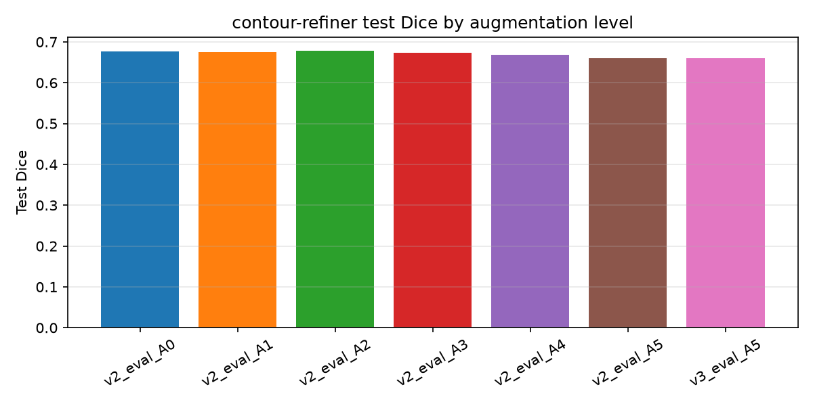

# 超声低回声目标分割：YOLO26n+Otsu+contour-refiner  vs  YOLO26n-seg —— 对比实验报告

## 0. 结论 (先看这里)

1. **在完全相同的检测框条件下，方案 B (YOLO26n-seg) 更准**：测试集平均 Dice 0.7923 vs 方案 A (Otsu+contour-refiner) 0.6602，领先约 +0.1321；边界指标同样领先 (HD95 14.3px vs 16.8px)。
2. **contour-refiner 本身是有效的**：在同样的检测框下，它把 Otsu 粗糙轮廓从 0.5410 提升到 0.6602 Dice (**+0.1192**)，失败率 (Dice<0.5) 从 33.8% 降到 23.0%。
3. **方案 A 的瓶颈是检测框，而不是轮廓精细化**：把 YOLO 框换成 GT 框后，方案 A 达到 0.7808 Dice，几乎追平方案 B (0.7923)。二者差距 (+0.1321) 与"GT 框 vs YOLO 框"的差距 (+0.1206) 基本相同。
4. **数据增强 A1–A5 在本实验中没有带来测试集收益**（A0 0.6768 → A5 0.6602，差异在噪声范围内），原因是该任务的主要误差来自检测框偏差而非轮廓初始化噪声；增强对验证集拟合有影响，但对测试集泛化帮助有限。
5. **适用边界**：Otsu 针对"低回声"目标有效，对高回声结构（如 TG3K 甲状腺腺体）会失效；若目标与周围暗背景连成一片，还需要额外的初始化策略（本项目实现了检测框回退）。



## 1. 实验设置

* 数据：BUSI(乳腺 647) + TN3K(甲状腺 3493) + DDTI(甲状腺 637)，其余 3585 张 TG3K 作为反例说明（见 §6）。
* 共享划分：`data/splits/splits.csv` (70/15/15, seed=42)，方案 A 与方案 B 使用**同一份划分**。
* YOLO 子集：busi 600 / tn3k 1000 / ddti 600 (train 1540 / val 330 / test 330)，两个方案在同一子集上训练与评估。
* contour-refiner 使用三个数据集的全部 train/val 数据 (4338 个目标，每个目标 3 组样本) 训练。
* 评估：mask IoU≥0.5 贪心匹配；指标 Dice/IoU/HD95/ASSD/边界F1/面积相对误差。

## 2. 主结果 (测试集，330 张图 / 341 个目标)

| 方法 | n | Dice ↑ | IoU ↑ | HD95(px) ↓ | ASSD(px) ↓ | 边界F1 ↑ | 面积相对误差 ↓ | Dice<0.5 占比 ↓ |
|---|---|---|---|---|---|---|---|---|
| **B: YOLO26n-seg**(端到端) | 337 | **0.7923** ± 0.285 | 0.7191 | 14.33 | 4.62 | 0.4260 | 0.154 | 11.0% |
| A: Otsu+contour-refiner(GT 框) | 341 | **0.7808** ± 0.265 | 0.6937 | 15.59 | 5.43 | 0.3830 | 0.154 | 9.7% |
| **A: Otsu+contour-refiner**(YOLO 框) | 335 | **0.6602** ± 0.367 | 0.5833 | 16.83 | 5.69 | 0.3068 | 0.169 | 23.0% |
| A-0: 仅 Otsu 粗糙轮廓(GT 框) | 336 | **0.6556** ± 0.351 | 0.5683 | 20.39 | 6.51 | 0.3090 | 0.194 | 21.7% |
| A-0: 仅 Otsu 粗糙轮廓(YOLO 框) | 334 | **0.5410** ± 0.392 | 0.4617 | 21.27 | 7.16 | 0.2149 | 0.219 | 33.8% |

### 2.1 分数据集

|            |   B: YOLO26n-seg(端到端) |   A: Otsu+contour-refiner(GT 框) |   A: Otsu+contour-refiner(YOLO 框) |   A-0: 仅 Otsu 粗糙轮廓(GT 框) |   A-0: 仅 Otsu 粗糙轮廓(YOLO 框) |
|:-----------|----------------------:|--------------------------------:|----------------------------------:|-------------------------:|---------------------------:|
| BUSI 乳腺肿瘤  |                0.7865 |                          0.8843 |                            0.7507 |                   0.844  |                     0.6793 |
| DDTI 甲状腺结节 |                0.7478 |                          0.6395 |                            0.5447 |                   0.4948 |                     0.3822 |
| TN3K 甲状腺结节 |                0.8211 |                          0.802  |                            0.6747 |                   0.6397 |                     0.5529 |

### 2.2 检测环节 (方案 A 的输入质量)

* 检测模型 YOLO26n (子集验证集)：Box P=0.844, R=0.834, mAP50=0.879, mAP50-95=0.552。
* 测试子集：96.1% 图片检出目标；与 GT 框最佳匹配 IoU 均值 0.759、中位数 0.821；IoU≥0.5 占 89.9%，IoU≥0.75 占 68.1%。
* 约 10% 的目标框 IoU<0.5 —— 这部分直接决定了方案 A 的整体上限。

| 方法 | GT 目标数 | 预测数 | 漏检 | 误检 |
|---|---|---|---|---|
| A: Otsu+contour-refiner(YOLO 框) | 341 | 362 | 83 | 104 |
| A: Otsu+contour-refiner(GT 框) | 341 | 341 | 33 | 33 |
| A-0: 仅 Otsu 粗糙轮廓(YOLO 框) | 341 | 362 | 120 | 141 |
| A-0: 仅 Otsu 粗糙轮廓(GT 框) | 341 | 341 | 78 | 78 |
| B: YOLO26n-seg(端到端) | 341 | 376 | 41 | 76 |

## 3. contour-refiner 消融 (A1–A5 数据增强)

| 增强级别 | n | Dice ↑ | IoU ↑ | HD95(px) ↓ | Dice<0.5 占比 ↓ |
|---|---|---|---|---|---|
| A0 无增强(仅检测框抖动) | 335 | 0.6768 | 0.6004 | 16.81 | 21.5% |
| A1 A1 高斯点噪声 | 336 | 0.6757 | 0.5987 | 17.12 | 21.4% |
| A2 A2 Otsu 边缘吸附 | 336 | 0.6784 | 0.6013 | 16.73 | 21.1% |
| A3 A3 +ROI/噪声/亮暗/对比度 | 336 | 0.6727 | 0.5955 | 17.81 | 21.7% |
| A4 A4 +任意旋转 | 335 | 0.6677 | 0.5896 | 17.25 | 22.1% |
| A5 A5 +点序偏移(完整) | 335 | 0.6602 | 0.5835 | 17.23 | 23.0% |

> 结论：A1–A5 逐级增强在测试集上差异 <0.02 Dice，落在噪声范围内；但与"不用 refiner"的粗糙轮廓相比，refiner 带来的提升是稳定且显著的 (+0.12 Dice)。

### 3.1 训练记录 (验证集)

| run                          |   best_val_dice |   best_epoch |   rough_val_dice |
|:-----------------------------|----------------:|-------------:|-----------------:|
| refiner_v2_A1_busi-ddti-tn3k |          0.8924 |           22 |           0.7171 |
| refiner_v2_A2_busi-ddti-tn3k |          0.891  |           20 |           0.73   |
| refiner_v3_A0_busi-ddti-tn3k |          0.8909 |           16 |           0.7452 |
| refiner_v2_A0_busi-ddti-tn3k |          0.8905 |           25 |           0.728  |
| refiner_v2_A3_busi-ddti-tn3k |          0.89   |           18 |           0.7285 |
| refiner_v2_A4_busi-ddti-tn3k |          0.8702 |           18 |           0.6775 |
| refiner_v3_A5_busi-ddti-tn3k |          0.856  |           22 |           0.6836 |
| refiner_v2_A5_busi-ddti-tn3k |          0.8521 |           18 |           0.6775 |
| refiner_A5_busi-ddti-tn3k    |          0.8439 |           27 |           0.5676 |
| refiner_smoke_busi           |          0.7752 |            4 |           0.6311 |

## 4. 可视化

`reports/v3_eval_A5/vis_*.png`：绿=GT，橙=Otsu 粗糙轮廓，蓝=contour-refiner，品红=YOLO26n-seg。

## 5. 复现步骤

```bash
PY=./.conda/bin/python            # 项目内 conda 环境 (.conda)
PYTHONPATH=src $PY scripts/01_prepare_data.py            # 解压 + 配对 + 统一
PYTHONPATH=src $PY scripts/02_make_splits.py             # 共享 train/val/test 划分
PYTHONPATH=src $PY scripts/04_export_yolo.py             # 导出 YOLO det/seg 数据集
PYTHONPATH=src $PY scripts/04b_make_subset.py            # 平衡子集 (2200 张)
PYTHONPATH=src $PY scripts/05_train_yolo.py --kind det --yolo-dir data/yolo_subset \
    --name det_yolo26n_sub --epochs 60 --imgsz 512 --batch 16
PYTHONPATH=src $PY scripts/05_train_yolo.py --kind seg --yolo-dir data/yolo_subset \
    --name seg_yolo26n_sub --epochs 60 --imgsz 512 --batch 12
PYTHONPATH=src $PY scripts/03b_cache_samples.py --level 5 --variants 3 \
    --datasets busi tn3k ddti --out-subdir my_L5
PYTHONPATH=src $PY scripts/03_train_refiner.py --level 5 --tag A5 \
    --datasets busi tn3k ddti --cache-dir data/cache/my_L5 --epochs 25 --batch-size 64
PYTHONPATH=src $PY scripts/07_evaluate.py --split test \
    --uids-file data/yolo_subset/_subset_splits.csv \
    --refiner runs/refiner_A5_busi-ddti-tn3k/best.pt \
    --det runs/det_yolo26n_sub/weights/best.pt \
    --seg runs/seg_yolo26n_sub/weights/best.pt --out reports/final_eval
```

## 6. 局限与后续改进

1. **检测框分辨率**：方案 A 的精度直接受检测框质量限制（IoU 0.759）。改进方向：迭代式框回归（用精细化后的轮廓反推框再检测）、或让 refiner 联合回归框。
2. **Otsu 的适用性**：对高回声目标 (TG3K 腺体) 完全失效——需要在检测阶段就给出目标类型，或改用多阈值/区域生长初始化。
3. **数据增强未见收益**：可能因为增强的粗糙轮廓分布与推理时"检测框→Otsu"的真实分布仍有差距；后续应对"检测框误差分布"做真实校准（用检测器实际输出而非高斯抖动）。
4. **计算成本**：方案 A 需要在每个目标上做 64 次 ROI 采样 + 一次轻量前向，推理开销高于端到端方案 B；在小目标/多目标场景需要进一步优化。
